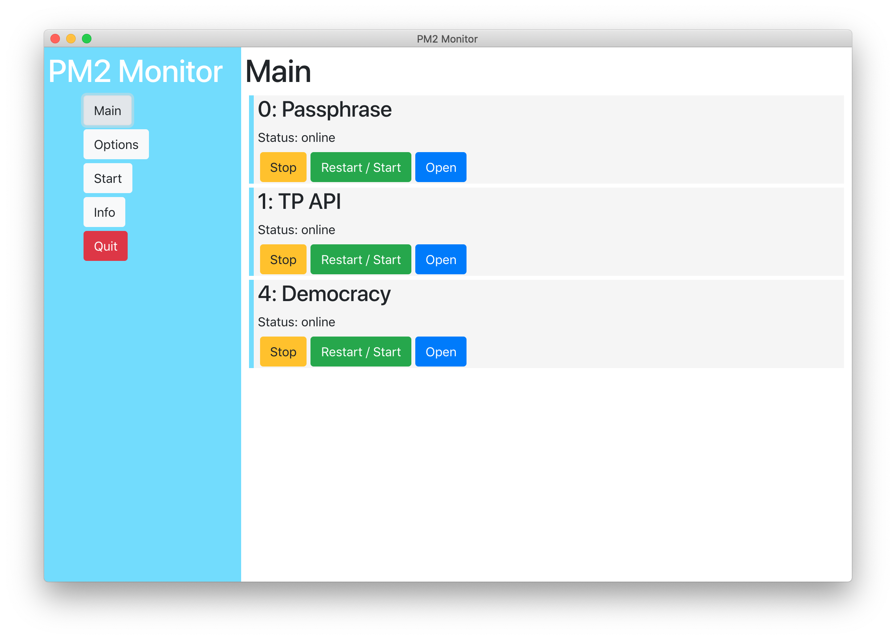
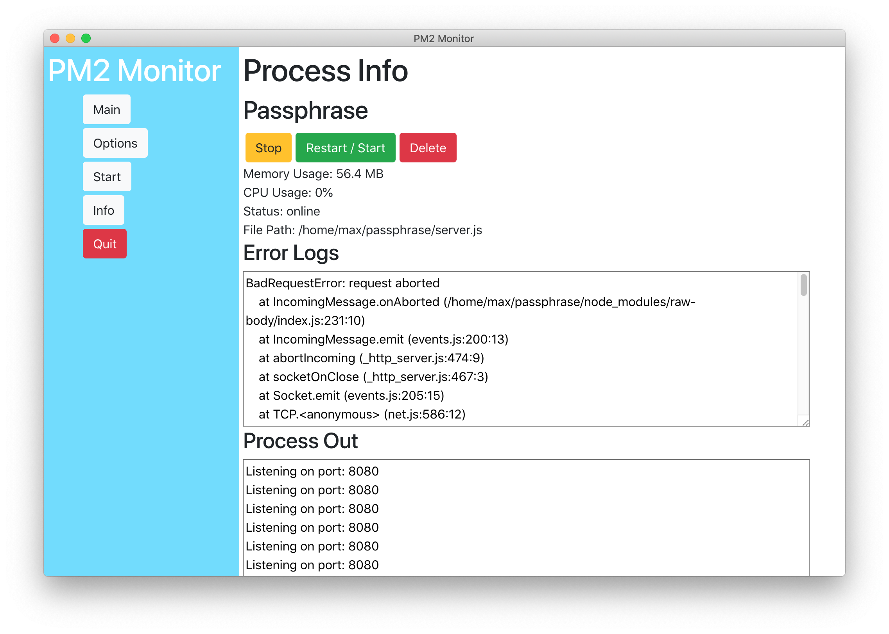
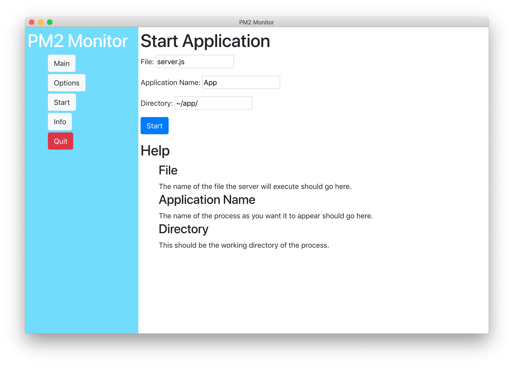

# PM2 Monitor

## What is PM2 Monitor?

  PM2 Monitor is a tool that allows you to visually and simply interface with your PM2 applications.
  It allows you to interface with processes on a remote server with SSH and locally.
  To connect to a remote server, the SSH key method of authentication is required.

  Using this application may be useful when working with people that may need to restart a remote process or view the logs.

## What do I do if I have a bug?

  If you have stumbled upon a bug, please submit it at our <a href='https://github.com/maxrumsey/PM2Monitor/issues'>Github Issues Page</a>.

## Installation
  1. Download the repository with `git clone https://github.com/maxrumsey/PM2Monitor`
  2. cd into the folder with `cd PM2Monitor`
  3. Install the dependencies with `npm install`
  4. Start the app with `npm start`
    - Follow the instructions below if you are using PM2 on a remote server.
  5. SSH into your remote server.
  6. Download the repository with `git clone https://github.com/maxrumsey/PM2Monitor`
  7. cd into the server folder with `cd PM2Monitor/server`
  8. Install Dependencies with `npm install`

## Social Links

  <a href='https://github.com/maxrumsey/PM2Monitor'>GitHub</a>

## Images

